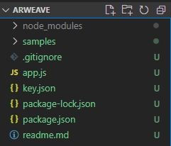
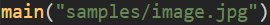
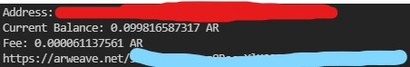

# ArUpload - Arweave File Uploader

Upload files to the permaweb. Pay once, store forever. 

To calculate fees based on file size, check out: [Arweave Fee Calculator](https://55mcexhgg4xql3l6xy4aoz2dzm23zghryqakakwtagj5djcm.arweave.net/71giX-OY-3LwXtfr44B2dDyzW8mPHEAKA-q0wGT0aRM)

> Files < 250KB: **0.000061137561 AR** (fixed)
>
> 0.000061 AR = $0.00183 (US$30/AR)

## <u>Usage</u>

`npm i` to install packages from package.json

### 1. Account Initialization

#### a) Have an pre-existing account

If you already have an existing Arweave account, store your Arweave key file (.json file) in the root directory of the folder & rename it to *key.json*. 

#### b) Create a new account

ArUpload will automatically create an Arweave account if it doesn't detect a key.json.

After creating an account, the Arweave key file will be stored in the root folder as *key.json*.

Do fund your account before proceeding to the next step:

- Buy AR from Centralized Exchange & deposit 
- [Get free AR tokens](https://faucet.arweave.net/)

*To be on the safe side, deposit 0.1 AR (=$3) to your wallet*

### 2. Upload File

Replace "samples/image.jpg" with the file path of your file.

 

### 3. Output

Console output should look as such:

URL to the uploaded file is at the last line

